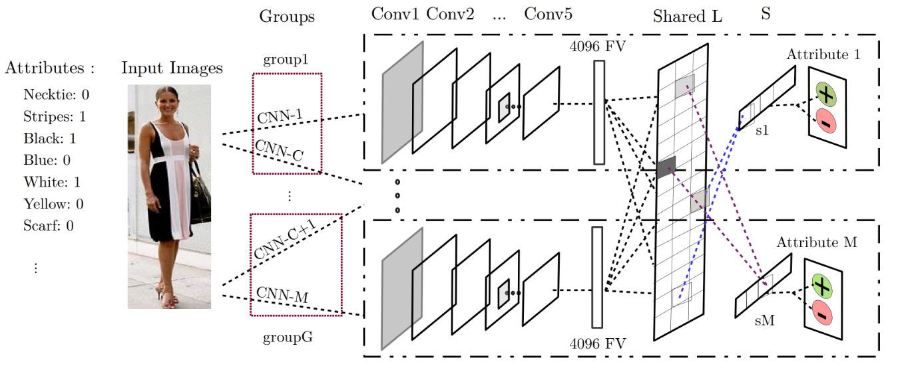

## Multi-task CNN Model for Attribute Prediction
this unfficial paper implmenatation [Multi-task CNN Model for Attribute Prediction](https://arxiv.org/pdf/1601.00400)  


<div align="center">    

<div align="center">
    </br>
    <figcaption>CNN-MTL </figcaption>
</div>
 
### Multi-task CNN Model for Attribute Prediction

[](https://academic.oup.com/bib/article/23/1/bbab545/6489100)
[](https://github.com/PaperWeek/Multi-task--APCNN)
[](https://github.com/PaperWeek/Multi-task--APCNN/issues) 
[](https://github.com/PaperWeek/Multi-task--APCNN/network) 
[](https://github.com/PaperWeek/Multi-task--APCNN/stargazers)
[](https://github.com/PaperWeek/Multi-task--APCNN/blob/master/LICENSE)
<!--
ARXIV   
[](https://www.nature.com/articles/nature14539)
-->
<!--  
Conference   
-->   
</div>

### Instalation 

1. clone the repo following the command 

```bash

git clone https://github.com/deep-matter/Multi-task--APCNN && Multi-task--APCNN
```

2. install packages from repo 

```bash 
pip install -e
```

## Convolution Neural Network 

**Notation** : each CNN has Trained of Single attributes which later on used the Feature extraction representation into the Multi-task leaning Framework if the dealing with large attributes **need a Fine-tune of CNN**


```python 
from models.cnn import CNN
import yaml 
import os

if __name__ == "__main__":
    
   

    model = CNN(
      input_channels=3, conv1_out_channels=64, 
      conv1_kernel_size=11, conv1_stride=4,
      conv2_out_channels=192,conv2_kernel_size=5, 
      conv3_out_channels=384,conv3_kernel_size=3, 
      conv4_out_channels=256,conv4_kernel_size=3, 
      conv5_out_channels=256, conv5_kernel_size=3,
      linear_input_dim=256*6*6,linear1_out_dim=4096, 
      linear2_out_dim=4096)

    # input tensor (batch size of 8, 3 channels, 64x64 images)
    sample_input = torch.randn(8, 3, 64, 64)
    output = model(sample_input)
    print("Output shape:", output.shape)
```  

### Multi-task Learning Framework 

```python 
import torch
from models.mtl import MTL
from models.cnn import CNN

if __name__ == "__main__":
    # Define the parameters for the CNN model
    cnn_params = {
        'input_channels': 3,
        'conv1_out_channels': 64,
        'conv1_kernel_size': 11,
        'conv1_stride': 4,
        'conv2_out_channels': 192,
        'conv2_kernel_size': 5,
        'conv3_out_channels': 384,
        'conv3_kernel_size': 3,
        'conv4_out_channels': 256,
        'conv4_kernel_size': 3,
        'conv5_out_channels': 256,
        'conv5_kernel_size': 3,
        'linear_input_dim': 256 * 6 * 6,
        'linear1_out_dim': 4096,
        'linear2_out_dim': 4096
    }
    
    base_cnns = [
        CNN(**cnn_params),  # Group 1 CNN
        CNN(**cnn_params),  # Group 2 CNN
        CNN(**cnn_params)   # more groups as needed
    ]
    
    # number of binary attributes
    num_attributes = 10
    
    # MTL model with the base CNNs and the number of attributes
    mtl_model = MTL(base_cnns=base_cnns, num_attributes=num_attributes)
    
    # Create a input tensor (batch_size=8, channels=3, height=64, width=64)
    sample_input = torch.randn(8, 3, 64, 64)
    
    output = mtl_model(sample_input)
    
    print("Output shape:", output.shape)
```

### Solving the Optimization Problem of Equation


```python 
from src.models.cnn import CNN
from src.models.mtl import  MTL
from src.models.optimizer import optimize_s, optimize_l
from src.models.loss import hinge_loss

if __name__ == "__main__":
    cnn_params = {
        'input_channels': 3,
        'conv1_out_channels': 64,
        'conv1_kernel_size': 11,
        'conv1_stride': 4,
        'conv2_out_channels': 192,
        'conv2_kernel_size': 5,
        'conv3_out_channels': 384,
        'conv3_kernel_size': 3,
        'conv4_out_channels': 256,
        'conv4_kernel_size': 3,
        'conv5_out_channels': 256,
        'conv5_kernel_size': 3,
        'linear_input_dim': 256 * 6 * 6,
        'linear1_out_dim': 4096,
        'linear2_out_dim': 4096
    }
    base_cnns = [
        CNN(**cnn_params),  # Group 1 CNN
        CNN(**cnn_params),  # Group 2 CNN
        CNN(**cnn_params)   # more groups as needed
    ]
    num_attributes = 5  
    model = MTL(base_cnns=[base_cnn], num_attributes=num_attributes)  #  Multi-group CNN is used
    
    # Define the  tensor image  and attribute labels
    inputs_image = torch.randn(1, 3, 224, 224)
    attributes = torch.tensor([[1, -1, 1, -1, 1]], dtype=torch.float16)
    
    # Define the optimizers for S and L matrices
    optimizer_s = optim.Adam(model.task_specific_layers.parameters(), lr=1e-4)
    optimizer_l = optim.Adam(model.latent_task_matrix.parameters(), lr=1e-4)
    
    scaler = amp.GradScaler()
    
    # Perform the optimization process
    optimize_model(model, inputs_image, attributes, optimizer_s, optimizer_l, scaler, num_iterations=10)
    
    # the parameters of the task-specific layers and latent task matrix
    print("Final Combination Matrix S:", model.task_specific_layers)
    print("Final Latent Task Matrix L:", model.latent_task_matrix.weight)
    
    # Perform a dummy forward pass and print the output shape
    with torch.no_grad():
        dummy_output = model(inputs_image)
    print("Output Shape:", dummy_output.shape)  # Output shape should be (1, num_attributes)
```


### Tasks under Progress 

- [ ] built DataLoader of Animals with Attributes (AwA) and the Clothing
Attributes Dataset
- [ ] Evalaution Metric G-groups of Differents num attributes
- [ ] Multi-parallesim Training on GPUs using Torch.distub
- [ ] training the MTL Framework on Fine-tune CNN of each attribute 


### Additional Improve could be useful for better generalization with Shared feature Follwoing :

**Integration of Dynamic Weight Average (DWA) in Multi-Task Learning Framework**

In our multi-task learning framework, where we aim to predict multiple binary semantic attributes from images using a shared CNN backbone and task-specific layers, balancing the training of these multiple tasks is crucial. Given the structure of our model, which includes a shared latent task matrix \( L \) and task-specific combination matrices \( S \), the integration of Dynamic Weight Average (DWA) can significantly enhance the training process by addressing the challenge of task balancing.

1. How DWA Fits into MTL:

1. **Task Weighting Across Attributes**: In the framework, each attribute is predicted through a separate task-specific layer, with the shared CNN features being fed into these layers. DWA can be applied to dynamically adjust the weights assigned to the loss of each attribute during training. This ensures that no single attribute's task dominates the learning process, leading to more balanced and robust feature learning.

2. **Adapting to Loss Changes**: As training progresses, the loss for each attribute will naturally change at different rates. DWA will monitor these changes and adjust the task weights accordingly. For example, if one attribute's loss is not decreasing as expected, DWA will increase its weight to emphasize learning for that attribute, whereas tasks with rapidly decreasing losses will have their weights reduced, preventing overfitting.

3. **Simplified Implementation**: Our current optimization approach already computes the task-specific losses for each attribute. Implementing DWA is straightforward in this context, as it only requires modifying how these losses are weighted before summing them up to form the overall loss. This adjustment can be made without altering the core structure of our model, making it a seamless integration.

4. **Impact on Optimization**: By incorporating DWA, we can expect a more adaptive and balanced optimization process. During each optimization step, the DWA-adjusted loss will ensure that the gradient updates are balanced across all tasks, leading to better generalization across the binary attribute predictions.

5. Benefits:

- **Enhanced Generalization**: By ensuring that each task receives appropriate attention during training, DWA helps improve the generalization performance of the model across all tasks.

### Ideas Could Improve the exitence work 

1. Joint Embedding Optimization which could Align both text of attribute and Images to learn the Localization 

```bibtex
@article{he2023localized,
  title={Localized text-to-image generation for free via cross attention control},
  author={He, Yutong and Salakhutdinov, Ruslan and Kolter, J Zico},
  journal={arXiv preprint arXiv:2306.14636},
  year={2023}
}

```
2. ViT Vision transfomer using Cross Attention-Modal to set atmtribute as Query and KV (images) 

```bibtex
@inproceedings{chen2021crossvit,
  title={Crossvit: Cross-attention multi-scale vision transformer for image classification},
  author={Chen, Chun-Fu Richard and Fan, Quanfu and Panda, Rameswar},
  booktitle={Proceedings of the IEEE/CVF international conference on computer vision},
  pages={357--366},
  year={2021}
}

```

3. Large-Vision Langauge Model used Mixed-Fused Tokens Embedding or Graph-LLM Constuctive learning such CLIP model to leand Caption 

```bibtex
@article{chen2024fewer,
  title={Fewer Tokens and Fewer Videos: Extending Video Understanding Abilities in Large Vision-Language Models},
  author={Chen, Shimin and Yuan, Yitian and Chen, Shaoxiang and Jie, Zequn and Ma, Lin},
  journal={arXiv preprint arXiv:2406.08024},
  year={2024}
}

```
```bibtex
@article{team2024chameleon,
  title={Chameleon: Mixed-modal early-fusion foundation models},
  author={Team, Chameleon},
  journal={arXiv preprint arXiv:2405.09818},
  year={2024}
}
```

```bibtex
@article{team2024chameleon,
  title={Chameleon: Mixed-modal early-fusion foundation models},
  author={Team, Chameleon},
  journal={arXiv preprint arXiv:2405.09818},
  year={2024}
}
```

```bibtex
@article{chen2024llaga,
  title={Llaga: Large language and graph assistant},
  author={Chen, Runjin and Zhao, Tong and Jaiswal, Ajay and Shah, Neil and Wang, Zhangyang},
  journal={arXiv preprint arXiv:2402.08170},
  year={2024}
}
```


### Citation   
```bibtex
@article{abdulnabi2015multi,
  title={Multi-task CNN model for attribute prediction},
  author={Abdulnabi, Abrar H and Wang, Gang and Lu, Jiwen and Jia, Kui},
  journal={IEEE Transactions on Multimedia},
  volume={17},
  number={11},
  pages={1949--1959},
  year={2015},
  publisher={IEEE}
}
```  

### references Reading paper 


```bibtex
@inproceedings{xia2017attributes,
  title={Attributes-oriented clothing description and retrieval with multi-task convolutional neural network},
  author={Xia, Yizhang and Chen, Baitong and Lu, Wenjin and Coenen, Frans and Zhang, Bailing},
  booktitle={2017 13th International Conference on Natural Computation, Fuzzy Systems and Knowledge Discovery (ICNC-FSKD)},
  pages={804--808},
  year={2017},
  organization={IEEE}
}
``` 

```bibtex
@article{chun2020novel,
  title={A novel clothing attribute representation network-based self-attention mechanism},
  author={Chun, Yutong and Wang, Chuansheng and He, Mingke},
  journal={Ieee Access},
  volume={8},
  pages={201762--201769},
  year={2020},
  publisher={IEEE}
}

```
```bibtex
@inproceedings{li2023blip,
  title={Blip-2: Bootstrapping language-image pre-training with frozen image encoders and large language models},
  author={Li, Junnan and Li, Dongxu and Savarese, Silvio and Hoi, Steven},
  booktitle={International conference on machine learning},
  pages={19730--19742},
  year={2023},
  organization={PMLR}
}
```
```bibtex
@article{crawshaw2020multi,
  title={Multi-task learning with deep neural networks: A survey},
  author={Crawshaw, Michael},
  journal={arXiv preprint arXiv:2009.09796},
  year={2020}
}
```
```bibtex
@article{farias2016method,
  title={A method for image reduction based on a generalization of ordered weighted averaging functions},
  author={Farias, A and Costa, Valdigleis S and Lopes, Luiz Ranyer A and Bedregal, Benjam{\'\i}n and Santiago, Regivan},
  journal={arXiv preprint arXiv:1601.03785},
  year={2016}
}
```
```bibtex
@inproceedings{xie2021learning,
  title={Learning joint embedding with modality alignments for cross-modal retrieval of recipes and food images},
  author={Xie, Zhongwei and Liu, Ling and Li, Lin and Zhong, Luo},
  booktitle={Proceedings of the 30th ACM International Conference on Information \& Knowledge Management},
  pages={2221--2230},
  year={2021}
}
```


### Buitl by 

<p align="center">
  <a href="https://github.com/deep-matter" class="fancybox" ></a>
  <a href="https://www.linkedin.com/in/youness-el-brag-b13628203/" class="fancybox" ></a>
  <a href="mailto:younsselbrag@gmail.com" class="fancybox" ></a>
</p>
